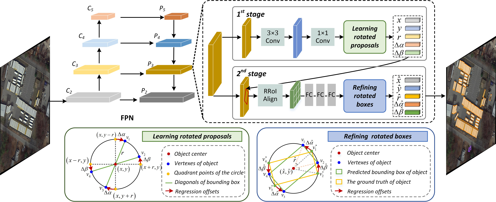

# [On Improving Bounding Box Representations for Oriented Object Detection](https://arxiv.org/)

Yanqing Yao, Gong Cheng, Guangxing Wang, Shengyang Li, Peicheng Zhou, Junwei Han

## Introduction



Abstract—Detecting objects in remote sensing images using oriented bounding boxes is flourishing but challenging, wherein the design of oriented bounding box representations is key to achieving accurate detection. In this paper, we focus on two issues that hinder the performance of two-stage oriented detectors: (i) the notorious boundary discontinuity problem, which would result in significant loss increases in boundary conditions, and (ii) the inconsistency in regression schemes between the two stages. We propose a simple and effective bounding box representation that draws inspiration from the polar coordinate system and integrates it into both two detection stages to circumvent the two issues. The first stage specifically initializes four quadrant points as the starting points of the regression for producing high-quality oriented candidates without any post-processing. In the second stage, the final localization results are refined using the proposed novel bounding box representation, which can fully release the capabilities of the oriented detectors. Such consistency brings a good trade-off between accuracy and speed. With only flipping augmentation and single-scale training and testing, our approach with ResNet-50-FPN harvests 76.25% mAP on the DOTA dataset with a speed of up to 16.5 FPS, achieving the best accuracy and the fastest speed among mainstream two-stage oriented detectors. Additional results on the DIORR and HRSC2016 datasets also demonstrate the effectiveness and robustness of our method.

## Installation

### Test Platform
- Ubuntu1804 + Anaconda
- GCC 7.5.0
- CUDA 10.1
- Python 3.8
- pytorch 1.8.1
- torchvision 0.9.1
- mmdet 2.2.0
- mmcv  0.6.2

a. install CUDA, Python and pytorch with conda. [official instructions](https://pytorch.org/)

``` shell
conda create -n qpdet
conda activate qpdet
conda install python=3.8 pytorch=1.8 torchvision=0.9 cudatoolkit=10.1 -c pytorch
```

b. clone modified mmdet code and install mmcv.

``` shell
git clone https://github.com/yanqingyao1994/QPDet
cd DODet
pip install -r requirements.txt
pip install pycocotools
pip install mmcv==0.6.2
pip install -v -e .
cd BboxToolkit
pip install -v -e .
```

## Get Started

### Dataset Preparation

Please refer to [DODet](https://github.com/yanqingyao1994/DODet#dataset-preparation) for dataset preparation.

### Training

``` shell
# one GPU training
python tools/train.py configs/qpdet_r50_fpn_1x_ss_dota.py

# multiple GPUs traing
python /tools/dist_train.sh configs/qpdet_r50_fpn_1x_ss_dota.py ${GPU_NUM}
```

### Test

``` shell
# single-gpu testing
python tools/test.py configs/qpdet.py ${CHECKPOINT_FILE} [--out ${RESULT_FILE}] [--eval ${EVAL_METRICS}] [--show]

# multi-gpu testing
python tools/dist_test.sh configs/qpdet.py ${CHECKPOINT_FILE} ${GPU_NUM} [--out ${RESULT_FILE}] [--eval ${EVAL_METRICS}]

# merge detection results
python tools/test.py configs/qpdet.py ${CHECKPOINT_FILE} --format-only --options save_dir=${SAVE_DIR}
```

### Benchmark

| Model | Backbone | Dataset | Lr schd |  mAP |
|:-:|:-:|:-:|:-:|:-:|
| QPDet | R50-FPN | DIOR-R |1x  | 64.20 |
| QPDet | R50-FPN | DOTA1.0 | 1x  | 76.25 |

## Citation
This code is based on MMdetection2[https://github.com/open-mmlab/mmdetection], and the core part of this code is modified from OBBDetection[https://github.com/jbwang1997/OBBDetection].

If you use this repo in your research, please cite the following information.

```
@unpublished{DODet,
   author = "Yao, Yanqing and Cheng, Gong and Wang, Guangxing and Li, Shengyang and Zhou, Peicheng and Han, Junwei",
   title = "On Improving Bounding Box Representations for Oriented Object Detection",
}

@article{cheng2022dual,
  title={Dual-aligned oriented detector},
  author={Cheng, Gong and Yao, Yanqing and Li, Shengyang and Li, Ke and Xie, Xingxing and Wang, Jiabao and Yao, Xiwen and Han, Junwei},
  journal={IEEE Transactions on Geoscience and Remote Sensing},
  volume={60},
  pages={1--11},
  year={2022},
  publisher={IEEE}
}

@article{li2020object,
  title={Object detection in optical remote sensing images: A survey and a new benchmark},
  author={Li, Ke and Wan, Gang and Cheng, Gong and Meng, Liqiu and Han, Junwei},
  journal={ISPRS Journal of Photogrammetry and Remote Sensing},
  volume={159},
  pages={296--307},
  year={2020},
  publisher={Elsevier}
}

@misc{cheng2021,
  title={Anchor-free Oriented Proposal Generator for Object Detection}, 
  author={Cheng, Gong and Wang, Jiabao and Li, Ke and Xie, Xingxing and Lang, Chunbo and Yao, Yanqing and Han, Junwei},
  year={2021},
  eprint={2110.01931},
  archivePrefix={arXiv},
  primaryClass={cs.CV}
}
```

## Contact

If you have any question, please email to eyao468@gmail.com.
